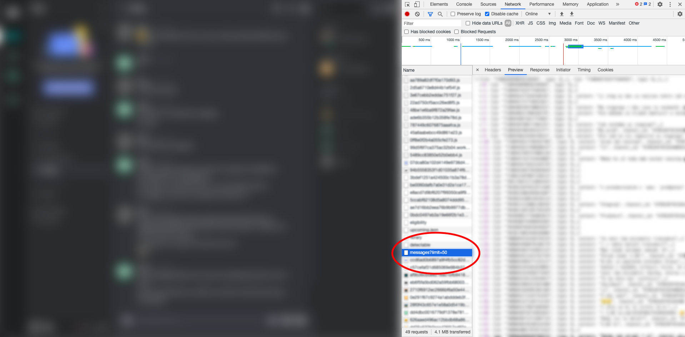
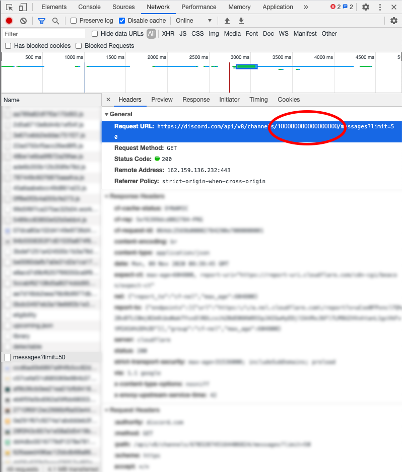
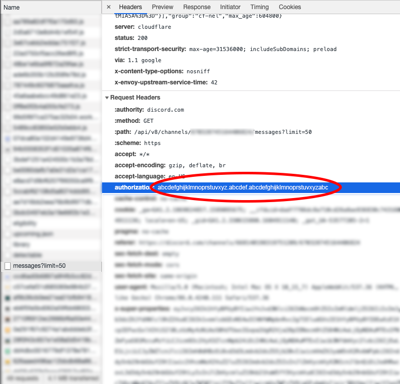

# Discord messages exporter

## Steps to export messages from your Discord channels

Step 1: Open your target Discord channel, open developer tools (F12), switch to Network tab and find request like `messages`



Step 2: In request `Headers` tab, `Request URL`, find channel ID as shown in image below



Step 3: In same `Headers` tab, find `authorization` token string



Step 4: Paste channel ID and authorization token into file `config.json`:
```json
{
    "channel": "[[ here is your channel ID ]]",
    "token": "[[ here is your authorization token ]]",
    "maxMessages": 5000
}
```

Step 5:
- install node modules: `yarn` or `npm i`
- run program
```
$ node index.js
```
